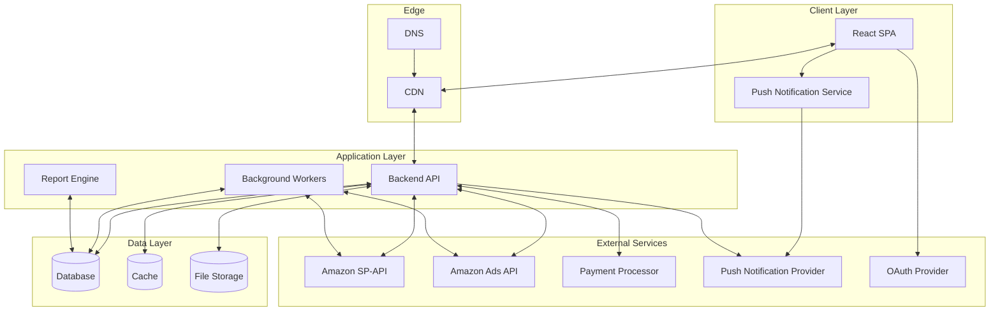

# E-Commerce Seller Management Platform — Architecture Reference

**A comprehensive architectural reference for building a multi-tenant SaaS platform serving Amazon sellers — designed for educational and portfolio purposes.**

**30+ architectural documents covering a full production-grade SaaS platform**

---

> **⚠️ IMPORTANT DISCLAIMER — For Educational & Portfolio Use Only**
>
> This repository is a **conceptual architecture reference** created solely for **educational and portfolio demonstration purposes**. It is intended to teach system design and architectural thinking — nothing more.
>
> - **No proprietary or confidential code is included.** Any code-like snippets shown are simplified, illustrative examples written fresh for this documentation. They are not copied from any existing product or service.
> - **All actual source code, if any, is private and is not shared here.** The architecture patterns described are based on publicly known industry best practices.
> - **No company data, trade secrets, API keys, credentials, or business logic from any real product has been used or leaked.** Every example is fabricated for learning.
> - **Technology choices, marketplace IDs, and service names shown are generic educational references.** No real vendor, product, or internal system is referenced.
> - **This repository demonstrates engineering design thinking — not proprietary asset exposure.**
>
> If you are reviewing this as a potential employer, you are evaluating **system design skill and architectural reasoning**, not reviewing proprietary intellectual property.

---

## Quick Navigation

| Section | What You Will Find |
|---------|-------------------|
| [Problem Space](#problem-space) | What pain points this platform concept addresses |
| [Feature Tour](#feature-tour) | Every major feature explained |
| [Architecture Overview](#architecture-overview) | How frontend, backend, and database connect |
| [Technology Stack](#technology-stack) | Tools and rationales |
| [Engineering Decisions](#engineering-decisions) | Key design choices and tradeoffs |
| [Full Documentation Map](#full-documentation-map) | Links to all deep-dive documents |

---

## Problem Space

Amazon sellers who grow past a certain size face a common challenge: their data and tools are scattered across multiple systems.

| Tool | What It Provides | Limitation |
|:-----|:---|:--------|
| **Seller Central** | Inventory management | Siloed, no cross-system integration |
| **Advertising Console** | PPC management | Separate login, separate data context |
| **Spreadsheets** | Profitability tracking | Manual, error-prone |
| **3PL Portals** | Warehouse management | No unified cross-location view |

A unified platform consolidates these into a single system with:
- A dashboard showing sales, profit, ad performance, and inventory health across multiple marketplaces
- Automated PPC bid management with configurable strategies
- Inventory forecasting with stockout predictions
- Financial reporting with true profit calculations

---

## Feature Tour

<strong>Dashboard and Analytics</strong>

The landing page. Summary cards show Sales, Units Sold, Net Profit, and Net Margin for the current period compared to the same period last year. Interactive charts break down sales trends, PPC summary, profit over time, and cost breakdowns. Date ranges are persisted per module.

*Deep dive: [Dashboard Analytics](analytics/dashboard-analytics.md)*

<strong>PPC Advertising</strong>

Manages all three Amazon ad types from one interface:

| Ad Format | What You Can Do |
|:----------|:----------------|
| **Sponsored Products** | Campaigns, ad groups, keywords, search terms, placements, negatives. Bulk editing across multiple campaigns. |
| **Sponsored Brands** | Header ad format with separate management interface. |
| **Sponsored Display** | Retargeting ads with audience and contextual targeting. |
| **Strategy Engine** | Set goals (target ACOS/ROAS), define rules. System monitors and adjusts bids, pauses underperformers, harvests winning keywords. |
| **Audit History** | Every automated change logged with before/after state. Filterable by date, campaign, or action type. |

*Deep dive: [PPC Module](ppc/overview.md)*

<strong>Inventory Management</strong>

| Module | What It Does |
|:-------|:-------------|
| **Inventory Health** | Stock levels, days of supply, inbound quantities with color-coded alerts. |
| **Products** | Searchable ASIN catalog with sales history, profit margins, and cost settings. |
| **Sales Analytics** | Charts showing unit sales, revenue, period comparisons. |
| **FBA Shipments** | Multi-step wizard: select products, pack boxes, generate labels, choose carrier, submit to Amazon. |
| **3PL and AWD** | Third-party logistics warehouse management and stock transfers. |
| **Production Orders** | Purchase order lifecycle: create, track, receive from suppliers. |
| **Demand Forecasting** | Calendar view predicting stockouts, suggesting reorder dates. |

*Deep dive: [Inventory Module](inventory/overview.md)*

<strong>Financial Reports</strong>

| Report | Description |
|:-------|:------------|
| **Profit and Loss** | Net profit calculation subtracting fees, COGS, and ad costs from revenue. |
| **Reimbursement Audit** | Scans for lost/damaged inventory or overcharged fees. |
| **Price Checker** | A/B price experiments comparing control vs. test prices. |

*Deep dive: [Analytics Module](analytics/dashboard-analytics.md)*

<strong>Smart Alerts and Notifications</strong>

| Feature | Description |
|:--------|:------------|
| **Alerts** | System monitors for conditions: shipments past ETA, low stock, negative feedback, high return rates. |
| **Tips** | Business optimization suggestions based on data analysis. |
| **Notifications** | Multi-channel delivery: push (Firebase), in-app panel, toast overlays. |

*Deep dive: [Notifications](notifications/notification-architecture.md) | [Smart Alerts](alerts/alert-architecture.md)*

<strong>Account and Billing</strong>

| Feature | Description |
|:--------|:------------|
| **Settings** | Multi-tab page: General, Shipment, Account, Subscription, Payment. |
| **Subscription Management** | Integrated with Stripe: free trial, paid plans, addons, monthly/yearly billing. |

*Deep dive: [Settings Overview](settings/overview.md)*

---

## Architecture Overview

The platform follows a four-layer architecture:

**The frontend** is a single-page React app communicating with a REST API. The API handles auth, business logic, and data access. Background workers process long-running tasks like data synchronization. A report engine handles async report generation.

**Data isolation** works at the marketplace level. Each marketplace (US, UK, DE, etc.) is treated as a separate tenant.

---

## Technology Stack

### Frontend

| Technology | Rationale |
|:-----------|:------------------|
| **React 18** | Mature ecosystem, component model for complex UIs |
| **Redux Toolkit** | Predictable state management with domain-sliced architecture |
| **React Router v6** | Nested routing with auth-guarded dashboard routes |
| **Bootstrap 5** | Responsive grid system with custom theming |
| **Chart.js 4** | Lightweight charting with custom plugin support |
| **FullCalendar 6** | Calendar views for demand forecasting |
| **Axios** | HTTP client with interceptor-based auth handling |

### Backend (Conceptual Architecture)

| Component | Description |
|:----------|:------------|
| **API Layer** | RESTful endpoints with versioning and standard error format |
| **Auth Service** | JWT issuance, refresh, and validation |
| **Domain Services** | Separated boundaries per business domain |
| **Queue System** | Background job processing for async operations |
| **Cache Layer** | Frequently accessed data caching |

### Infrastructure

| Component | Technology |
|:----------|:-----------|
| **Cloud Provider** | AWS |
| **CI/CD** | CodeBuild + CodeDeploy |
| **Containerization** | Docker |
| **CDN** | CloudFront |
| **Database** | PostgreSQL |

---

## Engineering Decisions

These design choices represent the tradeoffs encountered when building a platform of this complexity.

<strong>1. Feature Modules Own Everything They Need</strong>

Each business domain has its own folder with components, state management, and service integrations. The PPC module does not reach into the Inventory module's code. This enables independent development and testing.

**Tradeoff:** Some code duplication between modules, but zero unexpected breakage when refactoring within a module.

*See: [Component Architecture](frontend/component-architecture.md), [State Management](frontend/state-management.md)*

<strong>2. The Table System Is a Shared Component</strong>

Tables are everywhere — 30+ table instances use a shared CustomTable component handling sorting, column resizing, sticky headers, checkbox selection, and pagination. Column preferences are persisted with checksums so schema changes reset layouts gracefully.

**Tradeoff:** Building vs. buying — full control over rendering vs. maintenance overhead. A future iteration could use a virtualized library for the rendering layer while keeping the custom persistence layer.

*See: [Custom Table System](frontend/custom-table-system.md)*

<strong>3. Date Ranges Are Remembered Per Module</strong>

40+ saved date range keys. PPC date range is separate from Inventory date range. Users frequently switch between views with different time contexts.

**Tradeoff:** Separate keys increase storage, but users maintain distinct timeframes per module without manual switching.

*See: [Custom Date Ranges](analytics/custom-date-ranges.md)*

<strong>4. Async Operations Use a Singleton Poller</strong>

Long-running operations (report generation, data sync) use a polling pattern — every 30 seconds, up to 5 attempts. A singleton ensures only one polling loop runs at a time.

**Tradeoff:** Polling vs. WebSockets. Polling is simpler and more reliable for infrequent async operations. WebSockets would add reconnection complexity without proportional benefit for 5-10 reports per user per day.

*See: [Report Polling](notifications/report-polling.md)*

<strong>5. JWT Tokens Are Encrypted Client-Side</strong>

Tokens are encrypted before localStorage storage. Each token has two expiration mechanisms: the JWT's built-in expiry and a client-side timestamp. The client checks its timestamp first, preventing expired tokens from being sent to the server.

**Tradeoff:** Encryption adds complexity but protects tokens at rest. The double-check pattern avoids unnecessary API calls with known-expired tokens.

*See: [Session Management](authentication/session-management.md)*

<strong>6. Three Layers of Session Protection</strong>

Layer 1 — Activity extender prolongs token on navigation. Layer 2 — Inactivity timeout (configurable) detects idle sessions. Layer 3 — Periodic server-side validity check. All three synchronize across browser tabs via storage events.

**Tradeoff:** Three layers add code complexity but ensure no single point of failure. A layer failure does not disable the others.

*See: [Session Management](authentication/session-management.md)*

<strong>7. Zoom Changes Need Chart Coordinate Correction</strong>

At CSS zoom levels below 100%, Chart.js mouse detection breaks. A custom plugin divides coordinates by the zoom factor before Chart.js processes them. Three lines of code fix tooltip positioning at every zoom level.

*See: [UI Design System](frontend/ui-design-system.md)*

<strong>8. Logout Resets All State</strong>

The Redux root reducer intercepts the logout action and passes `undefined` to every slice, causing each to return its initial state. This prevents stale data from appearing if another user logs in on the same browser.

**Tradeoff:** Theme and zoom preferences are preserved via localStorage (not Redux), so users don't lose display settings on logout.

*See: [State Management](frontend/state-management.md)*

<strong>9. Sync Status Is Route-Aware</strong>

Each route maps to a specific sync step. The Inventory page checks `inventory_list`, the Products page checks `product_list`. Sync indicators only appear for relevant data on each page.

**Tradeoff:** Requires a route-to-step mapping, but prevents confusing users with irrelevant sync indicators.

*See: [Onboarding Data Sync](onboarding/data-synchronization.md)*

---

## Full Documentation Map

Every document below explores a specific architectural area — explaining business purpose, user workflow, system interactions, and engineering tradeoffs.

<strong>Architecture and Design</strong> <em>(5 docs)</em>

| Document | What It Covers |
|:---------|:---------------|
| [Architecture Overview](architecture/overview.md) | Full system architecture with diagrams |
| [Frontend Architecture](architecture/frontend-architecture.md) | Component tree, state management, routing |
| [Backend Architecture](backend/service-architecture.md) | Service design, API patterns, domain separation |
| [Multi-Tenant Design](architecture/multi-tenant-design.md) | Data isolation across marketplaces |
| [Data Flow](architecture/data-flow.md) | How data moves through the system |

<strong>Authentication</strong> <em>(3 docs)</em>

| Document | What It Covers |
|:---------|:---------------|
| [Authentication Flow](authentication/authentication-flow.md) | Registration, login, OAuth, and MFA |
| [Session Management](authentication/session-management.md) | JWT handling, timeouts, cross-tab sync |
| [Amazon Authorization](authentication/amazon-authorization.md) | SP-API and Ads API OAuth flow |

<strong>Feature Modules</strong> <em>(10 docs)</em>

| Document | What It Covers |
|:---------|:---------------|
| [PPC Advertising](ppc/overview.md) | Full PPC module including strategy automation |
| [Inventory Management](inventory/overview.md) | Inventory, shipments, 3PL, production orders |
| [Dashboard Analytics](analytics/dashboard-analytics.md) | Widgets, charts, and date range management |
| [Profit and Loss](analytics/profit-and-loss.md) | Financial reporting and cost breakdown |
| [Reimbursement Audit](analytics/reimbursement-audit.md) | Inventory loss and damage claim detection |
| [Review Management](analytics/review-management.md) | Customer review tracking and analysis |
| [Price Checker](analytics/price-checker.md) | A/B price experiment system |
| [Date Range System](analytics/custom-date-ranges.md) | Persistent date range preferences across views |
| [Notifications](notifications/notification-architecture.md) | Push, in-app, and polling-based notifications |
| [Smart Alerts](alerts/alert-architecture.md) | Alert engine, categories, and tip system |

<strong>Onboarding</strong> <em>(3 docs)</em>

| Document | What It Covers |
|:---------|:---------------|
| [Onboarding Overview](onboarding/overview.md) | Signup flow, plan selection, and Amazon authorization |
| [Email Verification](onboarding/email-verification.md) | Verification flow and route enforcement |
| [Data Synchronization](onboarding/data-synchronization.md) | Initial data sync architecture and status tracking |

<strong>Settings</strong> <em>(5 docs)</em>

| Document | What It Covers |
|:---------|:---------------|
| [Settings Overview](settings/overview.md) | Sidebar navigation, tabs, routing architecture |
| [General Settings](settings/general-settings.md) | Profile, password, 2FA, theme, zoom |
| [Account Settings](settings/account-settings.md) | Amazon accounts, API authorization |
| [Subscription Settings](settings/subscription-settings.md) | Plan management, addons, capacity |
| [Payment and Invoices](settings/payment-and-invoices.md) | Payment methods, invoices, receipts |

<strong>Frontend Deep Dives</strong> <em>(5 docs)</em>

| Document | What It Covers |
|:---------|:---------------|
| [Component Architecture](frontend/component-architecture.md) | How components are organized |
| [State Management](frontend/state-management.md) | Redux store design and slice architecture |
| [Custom Table System](frontend/custom-table-system.md) | Column persistence, sorting, resizing |
| [UI Design System](frontend/ui-design-system.md) | Theming, zoom, responsive layout |
| [Data Fetching](frontend/data-fetching-strategies.md) | Prefetching, polling, lazy loading |

<strong>Security and Integrations</strong> <em>(2 docs)</em>

| Document | What It Covers |
|:---------|:---------------|
| [Security Architecture](security/security-overview.md) | Token encryption, session layers, cross-tab sync |
| [External Integrations](integrations/external-integrations.md) | Third-party service integration patterns |

<strong>Infrastructure and Operations</strong> <em>(4 docs)</em>

| Document | What It Covers |
|:---------|:---------------|
| [Database Design](database/schema-architecture.md) | Multi-tenant schema, indexing, caching, migration patterns |
| [Deployment Pipeline](deployment/deployment-pipeline.md) | CI/CD, deployment strategies, rollback, health checks |
| [Cloud Infrastructure](infrastructure/cloud-architecture.md) | AWS services, CDN, scaling, security, cost optimization |
| [Testing Strategy](testing/testing-strategy.md) | Unit, integration, component tests, mocking, CI integration |

---

## About This Documentation

This repository is a **conceptual architecture reference** built to demonstrate system design thinking for a complex SaaS platform. Every pattern, decision, and workflow described here represents the kind of engineering considerations that go into building production-grade software.

**The intent is purely educational.** If you are evaluating engineering talent, this shows how an architect thinks through tradeoffs, handles complexity, and designs for scale. If you are building something similar, this serves as a reference for structuring your own system.

> **No proprietary code, trade secrets, API keys, or confidential business logic from any existing product is included, referenced, or leaked.** All examples, snippets, and patterns shown are fabricated for educational purposes using common industry practices. This is a teaching resource — nothing more.

---

[Full Documentation Map](#full-documentation-map) | [Architecture](#architecture-overview) | [Tech Stack](#technology-stack) | [Engineering Decisions](#engineering-decisions)

