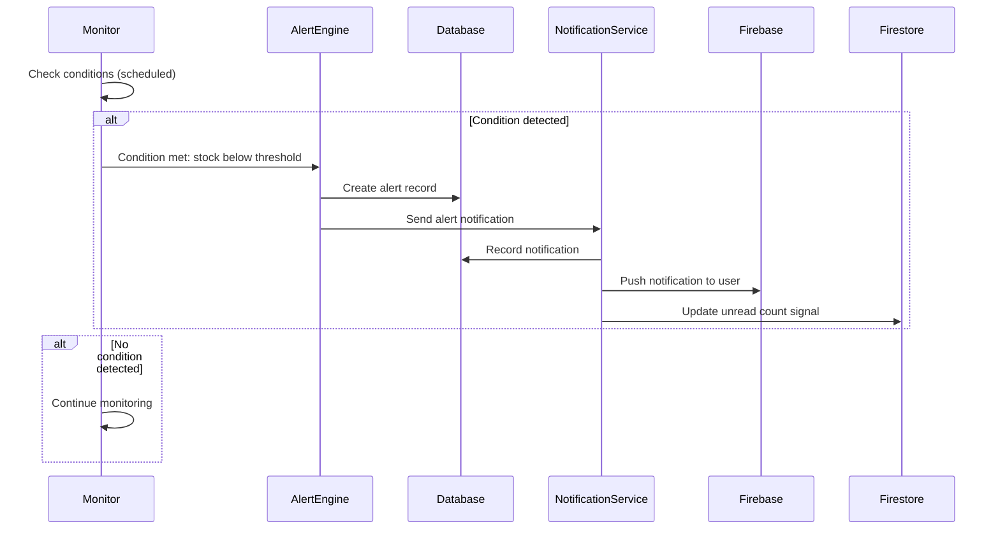

# Alert Architecture

The smart alerts system monitors inventory, shipments, and production orders for conditions that require user attention. When a condition is detected, an alert is created and delivered through the notification system.

---

## What You Will Learn

- How alert conditions are monitored
- How alerts are categorized and prioritized
- How alerts are delivered through the notification system
- How the alert configuration system works
- How alerts are managed (view, dismiss, resolve)

---

## Alert Sources

Alerts are generated from three main sources:

| Source                  | Monitors                           | Example Alerts                                                       |
| ----------------------- | ---------------------------------- | -------------------------------------------------------------------- |
| Shipment Alerts         | Shipment status and tracking       | Shipment past ETA, missing tracking ID, delivery window deadline     |
| Inventory Alerts        | Stock levels and product health    | Low stock, out of stock, excess inventory, price changes             |
| Production Order Alerts | Production order lifecycle         | Production order ETA arrived                                         |

---

## Alert Lifecycle

---

## Alert Configuration

Alerts are defined through configuration objects that specify the condition to check, the severity, and the message:

Alert configurations are defined as objects that specify the condition to check, severity level, message template, and action link for each alert type.

Each alert type specifies:
- **Condition** - What to check (stock level, shipment status, date comparison)
- **Severity** - Critical, warning, info
- **Message template** - How to describe the alert
- **Action link** - Where to navigate when clicked

---

## Alert Categories

Alerts are organized into categories that map to different parts of the application:

| Category           | Types                                                                                       |
| ------------------ | ------------------------------------------------------------------------------------------- |
| Shipments          | Past ETA, missing tracking ID, delivery deadline approaching                                |
| Inventory          | Stock close to 28 days, sale ending in 3 days, negative feedback, fulfillment price adjustment, excess inventory, high return rate |
| Production Orders  | ETA date arrived                                                                            |

Each category has a dedicated component that renders alerts for that type.

---

## Alert Data Structure

Each alert record contains an ID, type, category, severity level, contextual data (product name, ASIN, stock level), a human-readable message, read status, and timestamp.

---

## Interview Talking Points

**On the config-based alert engine:** "Alerts are defined as plain configuration objects. Each type specifies the condition to check, severity, message template, and action link. Adding a new alert type means adding one config entry and one display component. The engine does not need to change."

## Related Documents

- [Alert Categories](alert-categories.md) - Alert types by category
- [Alert Workflow](alert-workflow.md) - How alerts are processed
- [Tips System](tips-system.md) - Business optimization tips
- [Notification Architecture](../notifications/notification-architecture.md) - Notification delivery
