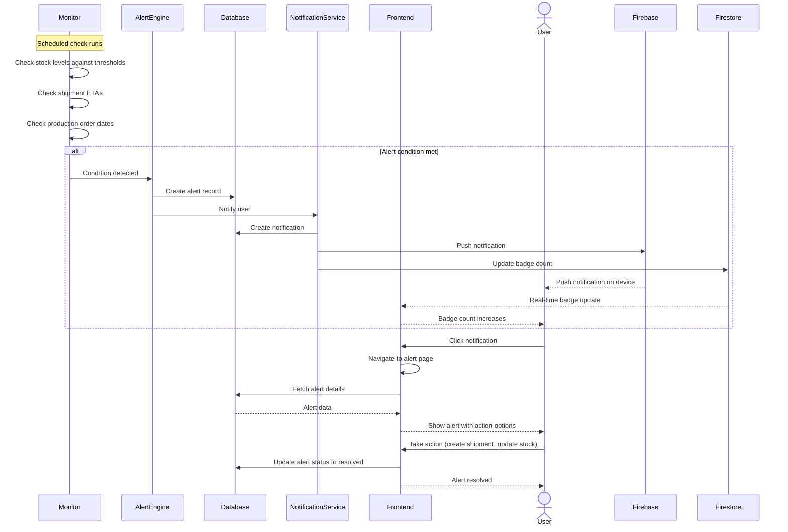

# Alert Workflow

This document explains how alerts move through the system from detection to resolution.

---

## What You Will Learn

- How alert conditions are monitored
- How alerts are created and delivered
- How users interact with alerts
- How alerts are resolved
- How the alert list page works

---

## Alert Detection to Resolution

---

## Alert Lifecycle States

| State      | Description                                               |
| ---------- | --------------------------------------------------------- |
| Active     | Alert condition exists and has not been addressed         |
| Dismissed  | User dismissed the alert without resolving                |
| Resolved   | Underlying condition has been fixed                       |
| Expired    | Alert condition no longer applies                         |

---

## Alert List Page

The alerts list page shows all active and historical alerts:

- **Filter by category** - Shipments, inventory, production orders
- **Filter by status** - Active, dismissed, resolved
- **Sort by date** - Newest first, oldest first
- **Sort by severity** - Critical first, warning, info
- **Search** - Search by product name, ASIN, or alert type

Each alert card shows:
- Alert type icon
- Severity indicator (color-coded)
- Description
- Product or resource name
- Timestamp
- Action buttons (dismiss, resolve, view details)

---

## Interview Talking Points

**On the full lifecycle:** "Alerts go through a complete lifecycle from detection to resolution. The system monitors conditions, creates alerts, notifies the user through multiple channels, and tracks whether the alert was resolved. This end to end flow is what makes alerts actionable, not just informative."

## Related Documents

- [Alert Architecture](alert-architecture.md) - System overview
- [Alert Categories](alert-categories.md) - Alert types
- [Tips System](tips-system.md) - Optimization tips
- [Notification Architecture](../notifications/notification-architecture.md) - Notification delivery
