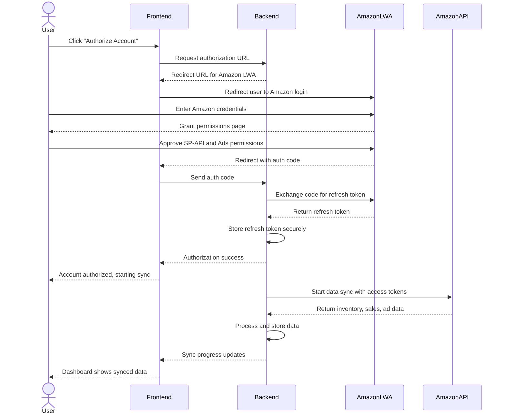
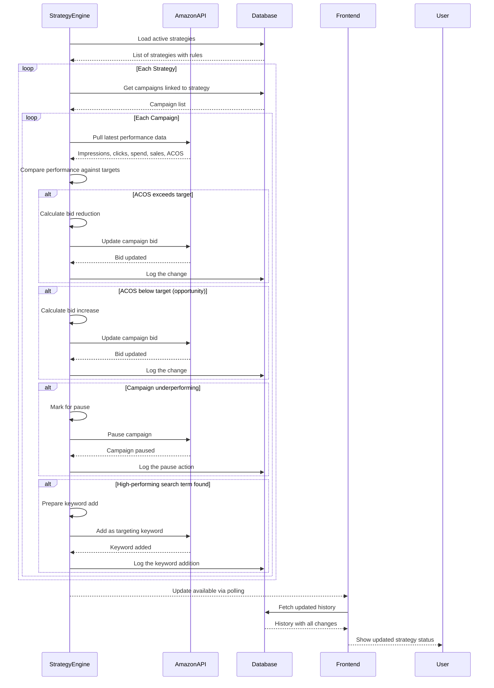
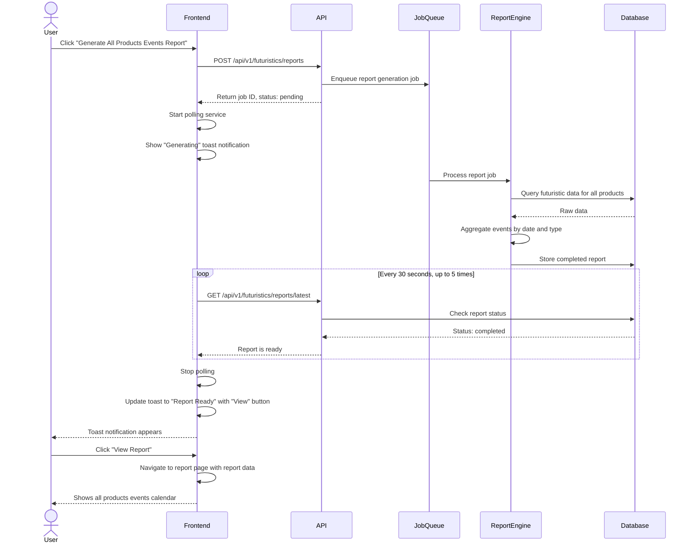
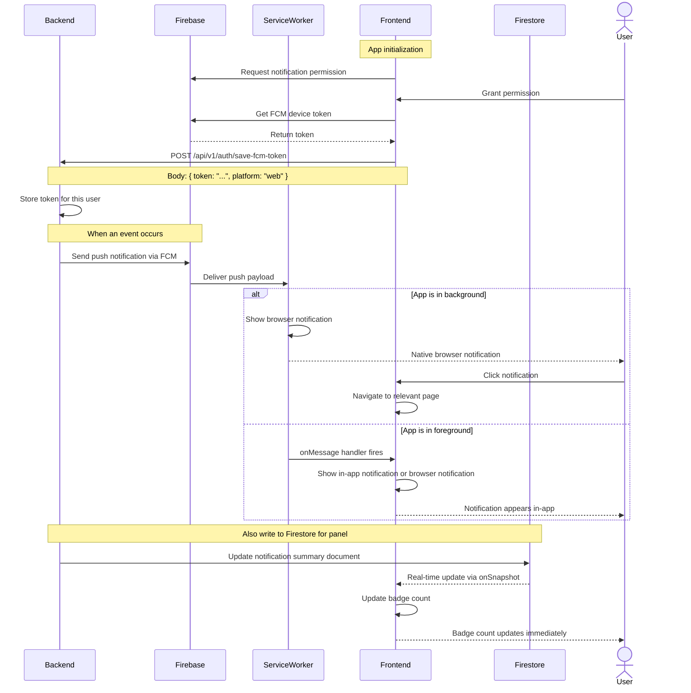
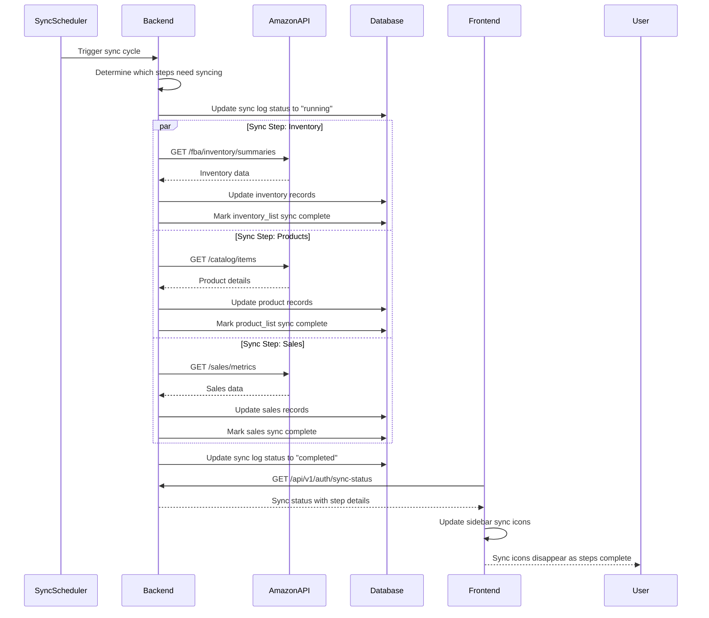

# Data Flow

This document traces how data moves through the system for several key workflows. Understanding these flows helps you see how the frontend, backend, Amazon APIs, and third-party services interact.

---

## What You Will Learn

- How data flows during Amazon account authorization
- How the PPC strategy engine evaluates and adjusts campaigns
- How the async report generation pipeline works
- How real-time notifications reach the user
- How data synchronization keeps things in sync with Amazon

---

## Amazon Account Authorization Flow

This flow happens when a user authorizes their Amazon account for the first time.

Key points about this flow:

- The frontend never sees the refresh token. It is exchanged and stored server-side.
- Amazon's LWA handles all credential collection. The platform never touches the user's Amazon password.
- The sync starts automatically after authorization. The user does not need to trigger it manually.

---

## PPC Strategy Evaluation Flow

This flow runs periodically to evaluate and adjust PPC campaigns based on strategy rules.

The strategy engine runs on a schedule in the background. It does not wait for user interaction. Every change it makes is logged with the before and after state, so users can audit what happened.

---

## Async Report Generation Flow

Some reports take too long to generate within a single HTTP request. This flow handles that case.

If the user navigates away from the page while a report is generating, the polling continues. When the report is ready, a toast notification appears on whatever page they are on. Clicking the toast navigates to the report view.

---

## Real-Time Notification Flow

Push notifications reach the user through two channels: browser push notifications (even when the app is backgrounded) and in-app notifications in the notification panel.

Two channels exist because browser push notifications work even when the tab is in the background, while Firestore provides instant in-app updates when the user is actively using the platform.

---

## Data Synchronization Flow

When Amazon data changes, the platform detects and syncs the changes.

The sync runs automatically on a schedule and can also be triggered manually from the settings page. If a sync step fails (for example, Amazon API returns an error), that step is retried on the next cycle. Completed steps are not reprocessed.

---

## Related Documents

- [Architecture Overview](overview.md) - System-level architecture
- [Multi-Tenant Design](multi-tenant-design.md) - Data isolation across marketplaces
- [Authentication Flow](../authentication/authentication-flow.md) - User authentication
- [Report Polling](../notifications/report-polling.md) - Async report generation in detail
