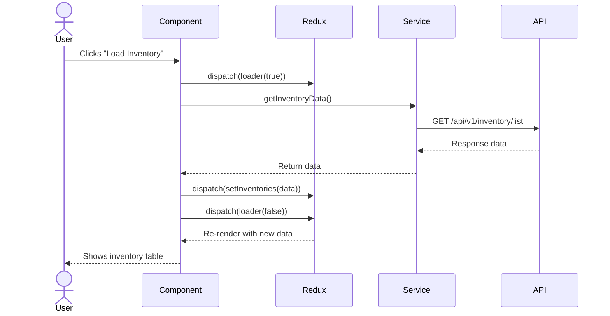

# Frontend Architecture

This document explains how the React frontend is structured, how state is managed, how routing works, and how components are organized across the application.

---

## What You Will Learn

- How the component tree is organized by business domain
- How Redux is structured with 20+ domain slices
- How routing separates public pages from the authenticated dashboard
- How the custom table system works
- How user preferences persist across sessions
- How the app handles zoom, themes, and responsive layouts

---

## Component Architecture

The component tree follows a domain-first organization. Each business domain owns its components, Redux slice, and service integrations. This keeps related code together and prevents accidental coupling between unrelated features.

```
src/
  components/
    auth/                 # Session security and token validation
    common/               # Shared components used across domains
      dashboard/          # Navbar, sidebar, notification panel
      context/            # Theme, scale, and settings contexts
      skeleton-loader/    # Loading state placeholders
    dashboard/            # Business logic components
      alerts/             # Smart alerts and alert categories
      analytis/           # Dashboard analytics widgets and graphs (actual folder name in project)
      inventory/          # Inventory, products, sales, shipments
      ppc/                # PPC campaigns, strategies, history
      reports/            # Financial reports (P&L)
      review/             # Order review management
      settings/           # Account, subscription, payment settings
    front/                # Public-facing pages (home, about, pricing)
  pages/                  # Page-level components
    dashboard/            # Dashboard pages
    front/                # Public pages
  network/                # API client configuration
  reducer/                # Redux slices (one per domain)
  services/               # Shared services and utilities
  store.js                # Redux store configuration
```

### Key Organization Rules

Each domain folder under `components/dashboard/` contains everything that domain needs. The PPC folder has subfolders for each ad type (sponsored-products, sponsored-brand, sponsored-display) plus cross-cutting concerns (campaigns, history, strategy). If you need to change how PPC targeting works, you go to one place.

Shared components live in `components/common/`. Things like the custom table, pagination, search bar, currency formatter, and modal dialogs. These components are generic enough that any domain can use them.

Page components in `pages/` are thin. They compose domain components together and handle page-level concerns like loading the initial data. They do not contain business logic.

---

## State Management

The application uses Redux Toolkit with 20+ domain slices. Each slice manages its own piece of the global state.

### Slice Organization

| Slice            | Manages                                                |
| ---------------- | ------------------------------------------------------ |
| auth             | Current user, Amazon accounts, sync logs, alerts, tips, subscription, invoices |
| app              | UI state: loader, sidebar collapse, notifications, phonebook |
| dashboard        | Sales statistics, dashboard data                       |
| inventory        | Inventory list                                         |
| product          | Product list and details                               |
| sales            | Sales statistics and comparisons                       |
| shipments        | Shipment list and tracking                             |
| orders           | Review data and charts                                 |
| futuristics      | Futuristic data and report status                      |
| three_pl         | 3PL warehouses and stock                               |
| ppc              | PPC analytics and statistics                           |
| sponsored        | Sponsored products and brands                          |
| campaign         | Campaign management                                    |
| strategy         | PPC strategy management                                |
| price_checker    | Price checker experiments                              |
| profit_loss      | Profit and loss reports                                |
| reimbursement    | Reimbursement data                                     |
| notification     | Notification items and metadata                        |
| invoice          | Invoice history                                        |

### How State Flows

Data flows in one direction. The user triggers an action (clicking a button, navigating to a page). A component dispatches a Redux action. A service layer makes an API call. When the response comes back, an action is dispatched to update the slice. The component re-renders with the new data.



### State Reset on Logout

When a user logs out, every slice resets to its initial state. This is handled by a root reducer that wraps all individual reducers:

When a logout action is dispatched, the root reducer passes `undefined` to every slice, causing each to return its initial state. This clears all cached data and prevents stale state from persisting between sessions.

---

## Routing Architecture

The application has two route structures: public-facing routes and authenticated dashboard routes.

### Public Routes

Public pages (home, about, pricing, login, signup) use a lightweight layout with a top navbar and footer. These routes do not require authentication.

```
/                        Home page
/about                   About us
/pricing                 Pricing plans
/login                   Login page
/signup                  Sign up
/reset-password          Password reset
/contact-support         Contact support
```

### Dashboard Routes

Authenticated routes use a full layout with sidebar navigation, top navbar, and the main content area. These routes are protected by an auth guard that redirects to login if the user has no valid session.

```
/dashboard               Main analytics dashboard
/inventory               Inventory health
/products                Product list and details
/sales                   Sales analytics
/shipments               Shipment list and creation
/ppc/dashboard           PPC analytics
/strategies              PPC strategy management
/sponsored-products      Sponsored Products campaigns
/sponsored-brand         Sponsored Brands campaigns
/sponsored-display       Sponsored Display campaigns
/campaigns               Campaign management
/history                 PPC change history
/smart-alerts            Smart alerts list
/reports/profit-and-loss Profit and loss report
/price-checker           Price checker experiments
/reimbursement           Reimbursement audit
/review                  Review management
/settings/*              Settings pages (general, accounts, subscription, etc.)
```

### Route Guard Logic

The dashboard route wrapper checks:

1. Is there a valid JWT token in storage? If not, redirect to login.
2. Is the session expired? If yes, redirect to session-expired page.
3. Does the user have the required permissions for PPC features? If not, show an upgrade prompt or redirect.

It also handles Amazon account authorization status. If the user navigates to a page that requires Amazon API access and they have not authorized their account, they see a prompt to connect.

---

## Custom Table System

Tables are the most common UI pattern in the application. There are 30+ different table configurations across the platform. Instead of building each one from scratch, there is a shared CustomTable component that handles everything.

### Features

- Column visibility toggling through a dropdown
- Column width resizing by dragging column borders
- Sortable columns (string, number, date, currency)
- Sticky headers that follow as you scroll down
- Sticky first columns for row identification
- Checkbox selection with master checkbox and bulk actions
- Custom pagination with configurable page sizes
- Fixed-position scrollbar at the bottom when the table is wider than the viewport

### Column Persistence

Each table has a unique key (like "ts_1" for the product table). Column preferences are saved to localStorage with a checksum:

Each table's column configuration is stored in localStorage alongside a checksum hash of the column field names. When a new column is added or an existing column is removed, the checksum changes and user preferences gracefully reset to defaults — preventing broken layouts after schema updates.

---

## Theme and Zoom System

### Theme (Dark/Light Mode)

The theme context reads the user's preference from localStorage and applies the appropriate CSS class to the body element. Chart.js defaults are updated to match the current theme so graph colors look right in both modes.

Public pages always use light mode. The dashboard respects the user's preference.

### UI Zoom

Users can scale the UI from 75% to 100% using CSS zoom. This is applied to the document element. A ScaleContext manages the current zoom level and persists it to localStorage.

Zoom causes a problem with Chart.js because the browser reports mouse coordinates in zoomed pixels, but Chart.js expects unzoomed coordinates. A custom Chart.js plugin fixes this by dividing event coordinates by the zoom factor before Chart.js processes them. This ensures tooltips, hover states, and click interactions work correctly at any zoom level.

### Color Themes

Users can apply color themes that change the accent colors of cards, buttons, and highlights. A theme class is applied to the body element, and CSS variables control the actual colors. This allows the interface to be personalized without changing the layout or functionality.

---

## Data Fetching Strategies

### Direct API Calls

Most data is fetched on demand when a page loads. The page component dispatches an action, the service layer calls the API, and the result is stored in Redux. Subsequent visits to the same page reuse the cached data.

### Prefetching

An ApiDataAutoComponent runs in the background when the app loads. It checks which data has not been fetched yet and preloads common datasets (inventory, products, shipments, phonebook). By the time the user navigates to those pages, the data is already in Redux.

This prefetching is smart about it. It only fetches data that has not been loaded yet. If the user has already visited the Products page, it skips the prefetch.

### Polling

For async operations (report generation, data sync), a singleton polling service checks for completion at regular intervals. The service is shared across the application so there is only one polling loop at any time.

The polling service is implemented as a singleton to prevent multiple loops from running simultaneously. It checks a status endpoint every 30 seconds for up to 5 attempts, then stops silently.

### Skeleton Loading

Every data-driven component shows skeleton placeholders while data is loading. The skeletons match the layout of the final content, so the page does not jump or rearrange when data arrives. This makes the app feel faster than showing a spinner.

---

## Service Layer

Shared services sit between components and API calls. They handle:

- **API configuration**: Axios instance with base URL, headers, and interceptors
- **Authentication**: Token storage, encryption, header generation
- **Amazon data sync**: Status checking and route-aware sync indicators
- **Firebase**: Initialization, push notification permission, token registration
- **Report polling**: Async completion checking
- **Table persistence**: Column preference save and restore
- **Date range persistence**: 40+ date range keys for cross-module consistency
- **Error handling**: Global exception handler for consistent error display

---

## Related Documents

- [Architecture Overview](overview.md) - System-level architecture
- [State Management](../frontend/state-management.md) - Deeper dive into Redux
- [Custom Table System](../frontend/custom-table-system.md) - Table architecture in depth
- [UI Design System](../frontend/ui-design-system.md) - Theming, zoom, responsive design
- [Data Fetching Strategies](../frontend/data-fetching-strategies.md) - Prefetching, polling, caching
