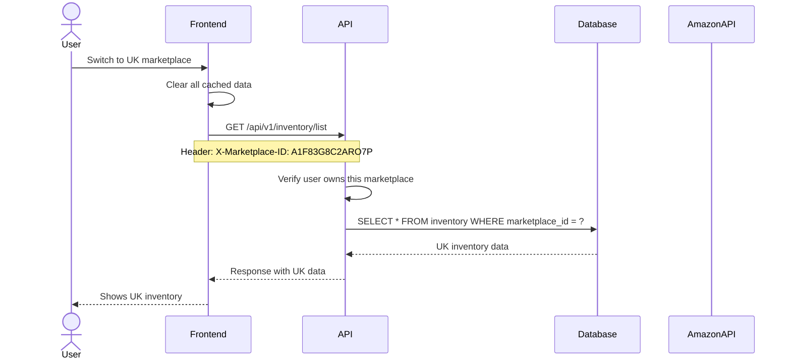
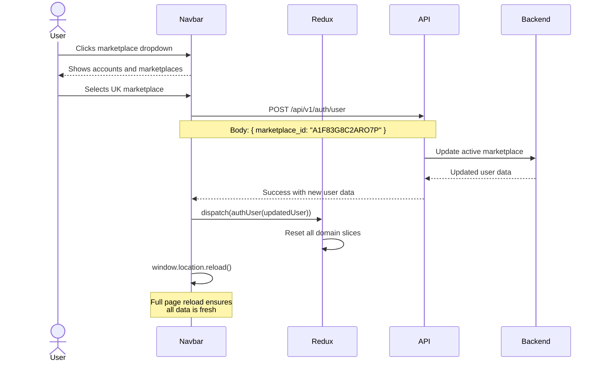

# Multi-Tenant Design

This document explains how the platform isolates data between different users and marketplaces. Multi-tenant architecture is one of the hardest things to get right in a SaaS product, so the patterns here are worth understanding.

---

## What You Will Learn

- How marketplaces act as tenants for data isolation
- How the frontend routes requests to the correct tenant context
- How the backend enforces data boundaries
- How the system prevents cross-tenant data leaks
- How users can switch between marketplaces

---

## Tenant Model

Each Amazon marketplace is treated as a separate tenant. When a seller operates in the US marketplace and the UK marketplace, those are two completely isolated data environments.

```
Tenant: Amazon US (ATVPDKIKX0DER)
  - Inventory for ASINs sold on Amazon.com
  - PPC campaigns targeting US customers
  - Sales data in USD
  - FBA shipments to US warehouses

Tenant: Amazon UK (A1F83G8C2ARO7P)
  - Inventory for ASINs sold on Amazon.co.uk
  - PPC campaigns targeting UK customers
  - Sales data in GBP
  - FBA shipments to UK warehouses
```

A user can have multiple Amazon accounts, and each account can have multiple marketplaces. The system allows switching between them from the navbar.

---

## Data Isolation Strategy

### Database Level

Every database query includes the marketplace ID as a filter. The backend service layer is responsible for always including this filter. If a query is made without a marketplace context, it is treated as a bug.

```sql
-- Every query looks like this
SELECT * FROM inventory_items
WHERE marketplace_id = 'ATVPDKIKX0DER'
  AND user_id = 12345;
```

There is no shared data between marketplaces. Not even lookup tables or reference data. This is stricter than necessary for most cases, but it eliminates an entire class of bugs where data from one marketplace accidentally appears in another.

### Frontend Level

The frontend stores the current marketplace context in the Redux auth slice. When the user switches marketplaces, the entire page reloads. This is a hard reset that clears all cached data for the previous marketplace and fetches fresh data for the new one.

The marketplace ID is included in API requests as a header or query parameter. The backend uses this to scope all queries.

### API Level

The backend validates that the requested marketplace belongs to the authenticated user. A user cannot access marketplace data they have not authorized. This check happens at the API gateway level before any business logic runs.



---

## Marketplace Switching Flow

The user can switch marketplaces from a dropdown in the top navbar. The dropdown is organized by Amazon account, then by marketplace within each account.

1. User clicks the current marketplace name in the navbar
2. A dropdown shows their Amazon accounts, each expandable to show marketplaces
3. User selects a different marketplace
4. Frontend sends a request to update the user's active marketplace
5. Backend updates the user record and returns the updated user data
6. Frontend stores the new user data, clears all Redux state, and reloads the page
7. All subsequent API calls use the new marketplace context



---

## Amazon Account Authorization

Before a user can access any marketplace data, they must authorize their Amazon account. This uses Amazon's Login with Amazon (LWA) OAuth flow.

### Authorization Flow

1. User clicks "Authorize Amazon Account" in settings
2. Frontend redirects to Amazon's LWA authorization page
3. User logs in to Amazon and grants the requested permissions
4. Amazon redirects back to the platform with an authorization code
5. Backend exchanges the code for refresh tokens
6. Backend stores the refresh tokens securely
7. Backend uses refresh tokens to get short-lived access tokens for API calls

### Permission Scopes

The platform requests two sets of permissions:

**Selling Partner API (SP-API)** - For inventory, orders, shipments, and financial data
**Advertising API** - For PPC campaign management and performance data

Users can authorize one or both scopes. If only SP-API is authorized, PPC features show a prompt to authorize the Advertising API.

---

## Data Synchronization

Once an Amazon account is authorized, the platform begins syncing data from Amazon's APIs. This is an asynchronous process managed by background workers.

### Sync Steps

The sync process runs sequentially through these steps:

1. **Inventory list** - FBA inventory levels, conditions, and quantities
2. **Product list** - ASIN details, categories, and attributes
3. **Sales data** - Sales history, units sold, revenue
4. **Shipment list** - Inbound and outbound shipments
5. **Reports** - Financial reports and fee data
6. **Orders** - Customer order history and reviews

### Sync Status Indicators

The sidebar shows a sync icon next to each menu item when its data is being synced. The icon animates while syncing and disappears when complete. Each menu item only shows the sync status for its own data.

```javascript
const routeToStepMap = {
    '/inventory': 'inventory_list',
    '/products': 'product_list',
    '/sales': 'sales',
    '/shipments': 'shipment_list',
    '/reports/profit-and-loss': 'reports',
    '/review': 'orders'
};
```

This gives users visibility into what data is up to date without overwhelming them with status information for unrelated modules.

---

## Security Boundaries

### User-Level Isolation

A user can only see data for marketplaces they have authorized. Even if a user has access to multiple marketplaces, each request is scoped to one marketplace at a time. The active marketplace determines what data is visible.

### Admin Isolation

Administrative actions are logged and auditable. If an admin needs to access a user's data for support purposes, the access is recorded. The system tracks who accessed what and when.

### Cross-Tenant Prevention

The system prevents cross-tenant data access at multiple levels:

- **API level**: Marketplaces are validated against the user's authorized accounts
- **Database level**: All queries include marketplace_id filters
- **Frontend level**: Marketplace switch triggers a full page reload and state reset
- **Cache level**: Cached data is invalidated on marketplace switch

---

## Related Documents

- [Architecture Overview](overview.md) - System-level architecture
- [Data Flow](data-flow.md) - How data moves through the system
- [Amazon Authorization](../authentication/amazon-authorization.md) - SP-API OAuth flow
- [Security Best Practices](../security/authentication-security.md) - Security architecture
