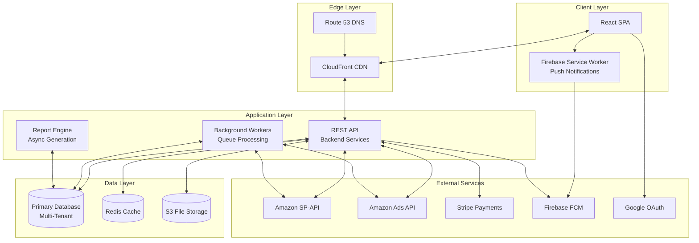

# Architecture Overview

This document explains how the platform is structured from end to end. It covers the major layers, how they communicate, and the design principles that guided the architecture.

---

## What You Will Learn

- The four main layers of the system and what each one does
- How the frontend talks to the backend and external APIs
- The design principles that keep the code maintainable as the product grows
- Where the bottlenecks are and how they are handled

---

## High Level System Architecture

The platform is split into four layers. Each layer has a specific job and communicates with the next layer through well-defined interfaces.

---

## The Four Layers

### 1. Client Layer

This is the React single-page application that runs in the user's browser. It handles everything the user sees and interacts with. The client layer does three things:

- Renders the UI and responds to user input
- Manages application state (current user, loaded data, UI preferences)
- Communicates with the backend API for data and actions

The client is fully stateless from the server's perspective. All session state is stored in encrypted browser storage. The server only needs to verify the JWT token on each request.

The Firebase service worker runs in the background and handles push notifications even when the browser tab is closed.

### 2. Edge Layer (CDN and DNS)

Static assets (JavaScript, CSS, images) are served through a CDN. This means a user in Europe downloads the same app from a server in Frankfurt while a user in Japan downloads from Tokyo. No server-side rendering happens, so there is zero server load for page delivery.

DNS routes traffic to the CDN for static content and to the backend API for dynamic requests.

### 3. Application Layer

This is where all business logic lives. It is divided into three parts:

**REST API** - Handles incoming requests from the frontend. Validates input, applies business rules, reads and writes data, and returns responses. Each domain (auth, inventory, PPC, billing) has its own service boundary.

**Background Workers** - Handle long-running operations that cannot complete within a single HTTP request. Syncing data from Amazon SP-API is the main example. A full sync can take minutes because Amazon rate-limits API calls. Workers process these in the background.

**Report Engine** - Generates complex reports that require aggregating large datasets. Reports like the futuristic data calendar or the profit and loss statement can take 30 seconds or more to generate. The engine runs these asynchronously and notifies the user when they are ready.

### 4. Data Layer

The database stores all application data with strict multi-tenant isolation. Each Amazon marketplace is a separate tenant. A Redis cache layer speeds up frequently accessed data. File storage (S3) holds generated reports, exported files, and user-uploaded content.

---

## Design Principles

These principles guided every major architecture decision.

### Domain Separation

Each business domain owns its code and data. The PPC module does not directly access inventory tables. The billing module does not know about shipment tracking. When one domain needs data from another, it goes through the API or a shared service interface. This prevents the kind of spaghetti dependencies that make large applications impossible to change.

### API First

The frontend is a consumer of the API, nothing more. There is no direct database access from the client. Every action goes through a REST endpoint that validates, authorizes, and processes the request. This makes it possible to build a mobile app or third-party integration later without rewriting business logic.

### Async Where Possible

Operations that take more than a few seconds are handled asynchronously. The frontend makes a request, gets back a job ID, and polls for completion. This keeps the API responsive and prevents browser timeouts.

The report polling service on the frontend handles this pattern consistently. It checks every 30 seconds up to 5 times, shows a notification when done, and cleans up after itself.

### Fail Gracefully

Every API call goes through a global error interceptor. 401 responses redirect to login. 403 responses show permission errors. Network failures show a toast notification. The user never sees a raw error message or a blank screen.

On the frontend, skeleton loaders show the layout of the page while data is being fetched. If the fetch fails, the skeleton stays in place and the user sees an error message. The page never jumps or rearranges after data loads.

### State in One Place

All shared application state lives in a Redux store with 20+ domain slices. Each slice manages its own data and exposes actions for updating it. When a user logs out, a root reducer resets every slice to its initial state, preventing any data from leaking between sessions.

User preferences (column layouts, date ranges, theme settings) are persisted to localStorage with checksum validation. When the underlying data schema changes, the checksum detects it and resets to defaults, preventing stale preferences from breaking the UI.

---

## Communication Patterns

### Frontend to Backend

The frontend uses Axios for all HTTP communication. The Axios instance is preconfigured with:

- The API base URL from environment variables
- Automatic JSON content type headers
- A timeout of 300 seconds for development, 500 seconds for production
- An interceptor that attaches the JWT bearer token to every request
- A response interceptor that handles 401 and 403 errors globally

### Backend to Amazon APIs

The backend communicates with Amazon SP-API and Advertising API using OAuth 2.0. Access tokens are short-lived and refreshed automatically using stored refresh tokens. The system respects Amazon's rate limits by queueing requests and processing them at a controlled pace.

### Backend to Frontend (Async)

For long-running operations, the flow looks like this:

1. Frontend sends a request to generate a report
2. Backend creates a job record, returns the job ID immediately
3. Backend worker processes the job asynchronously
4. Frontend polls a status endpoint every 30 seconds
5. When the job is complete, the frontend shows a notification
6. User clicks the notification to view the result

### Push Notifications

Firebase Cloud Messaging handles push notifications. The flow is:

1. Frontend requests notification permission from the browser
2. Firebase returns a device token
3. Frontend sends the token to the backend
4. Backend stores the token and uses it to send push messages
5. A service worker handles background messages and shows browser notifications
6. In-app notifications appear in the notification panel via Firestore

---

## Key Numbers to Know

| Metric                        | Value                                          |
| ----------------------------- | ---------------------------------------------- |
| Redux slices                  | 20+ domain-specific slices                     |
| API timeout (development)     | 300 seconds                                    |
| API timeout (production)      | 500 seconds                                    |
| Polling interval              | 30 seconds                                     |
| Max polling attempts          | 5                                              |
| JWT token expiry              | Configurable (default 1 hour)                  |
| Session inactivity timeout    | Configurable (default varies)                  |
| CDN edge locations            | Global (AWS CloudFront)                        |
| Table columns configurable    | Per user, persisted with checksums             |

---

## Related Documents

- [Frontend Architecture](frontend-architecture.md) - Component structure, state management, routing
- [Backend Architecture](../backend/service-architecture.md) - Service design and API patterns
- [Multi-Tenant Design](multi-tenant-design.md) - Data isolation across marketplaces
- [Data Flow](data-flow.md) - End-to-end flow with sequence diagrams
- [Authentication Flow](../authentication/authentication-flow.md) - How users authenticate
