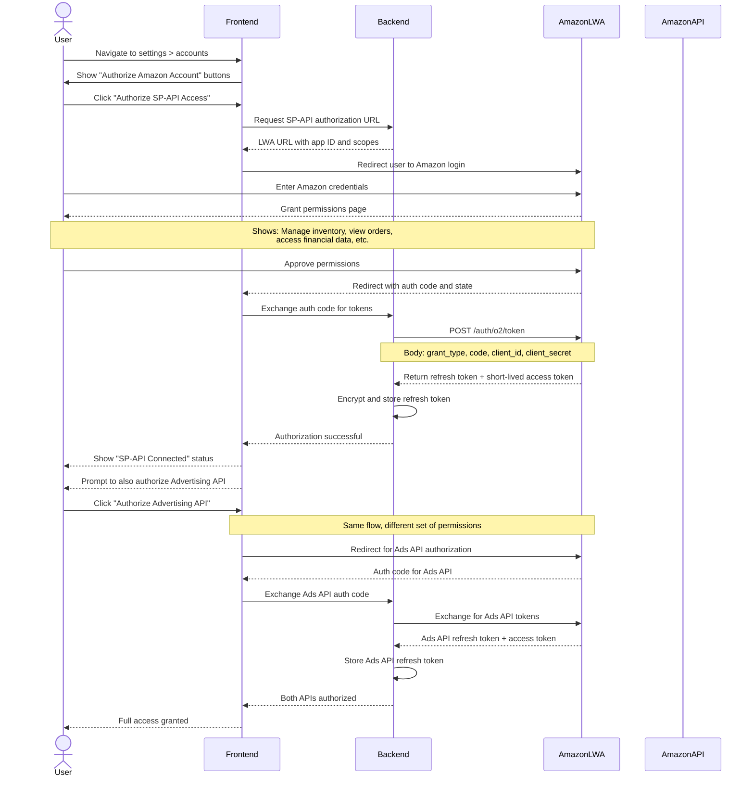

# Amazon Authorization

This document explains how the platform connects to Amazon's Selling Partner API (SP-API) and Advertising API. This is the core integration that makes the entire platform possible.

---

## What You Will Learn

- How Amazon OAuth 2.0 (Login with Amazon) works
- How the two Amazon APIs are authorized separately
- How access tokens are obtained, refreshed, and used
- How the frontend handles the authorization flow
- How the backend manages API credentials securely
- How users can tell when their accounts are connected

---

## Authorization Overview

The platform integrates with two Amazon APIs:

1. **Selling Partner API (SP-API)** - For inventory, orders, shipments, financial data, and product information
2. **Advertising API** - For PPC campaigns, ad groups, keywords, search terms, and performance metrics

Both APIs use OAuth 2.0 with Login with Amazon (LWA) for authorization. The user grants permission once, and the backend stores refresh tokens that are used to obtain short-lived access tokens for API calls.

---

## Authorization Flow

---

## Two Separate Authorization Steps

The SP-API and Advertising API are authorized separately. A user can authorize one without the other.

### SP-API Authorization

Required features: Inventory management, product listing, sales data, shipment tracking, financial reports, order reviews

The SP-API authorization requests these permissions:

- Read inventory data
- Read and write product listings
- Read order data
- Read financial reports
- Read and write shipment data

### Advertising API Authorization

Required features: PPC campaign management, advertising analytics, strategy automation

The Advertising API authorization requests these permissions:

- Read and write campaign data
- Read advertising performance metrics
- Manage ad groups, keywords, and targeting

---

## How the Frontend Handles Authorization Status

The user's authorization status is stored in the Redux auth slice and checked throughout the application.

### Status Flags

Two flags control what the user can access:

Two flags in the auth slice control feature access: `is_authorized_seller_api` for inventory/products/sales/shipments, and `is_authorized_ads_api` for PPC features. When a user navigates to a page that requires authorization they haven't granted, they see a prompt to connect their account instead of the page content.

If the user is on a PPC page and has not authorized the Advertising API, they see a prompt to connect their account instead of the page content.

### Notification Visibility

The notification panel also checks authorization status. If SP-API is not authorized, the notification bell is hidden entirely. There is no point showing notifications about data the user cannot access.

---

## Token Management on the Backend

### Refresh Token Storage

When a user completes authorization, the backend receives a long-lived refresh token. This token is encrypted and stored in the database, associated with the user's account and marketplace.

### Access Token Lifecycle

1. The backend requests a short-lived access token using the refresh token
2. The access token is valid for approximately 1 hour
3. The backend caches the access token and uses it for API calls
4. When the token expires, the backend requests a new one using the refresh token
5. If the refresh token itself expires or is revoked, the user must re-authorize

### Rate Limit Handling

Amazon APIs have strict rate limits. The backend handles this by:

- Queueing API requests and processing them at a controlled rate
- Implementing exponential backoff on rate limit errors
- Spreading sync operations across multiple queue workers
- Caching API responses to reduce repeated calls

---

## Frontend Authorization Pages

### Authorize APIs Page

This page shows the user's current authorization status and provides buttons to authorize missing APIs.

- If neither API is authorized, it shows two buttons: "Authorize SP-API" and "Authorize Ads API"
- If SP-API is authorized but Ads API is not, only the Ads API button is shown
- If both are authorized, it shows a success message

### Amazon Authorized Page

This is the callback page that Amazon redirects to after authorization. It receives the authorization code from the URL query parameters, sends it to the backend, and then redirects the user back to their previous page.

---

## Sync Status

After authorization, the backend starts syncing data from Amazon. The sync status is tracked per-step and exposed via an API endpoint.

The sync status object tracks each step's status (pending, running, completed, failed) and is exposed via a status API endpoint. The frontend uses this to show animated sync icons in the sidebar next to each menu item.

The frontend shows sync status in the sidebar as animated icons next to each menu item. When the sync finishes for a particular module, its icon stops animating.

---

## Related Documents

- [Authentication Flow](authentication-flow.md) - User login and registration
- [Session Management](session-management.md) - JWT handling and session protection
- [Multi-Tenant Design](../architecture/multi-tenant-design.md) - Marketplace isolation
- [Data Synchronization](../onboarding/data-synchronization.md) - Amazon data sync pipeline
