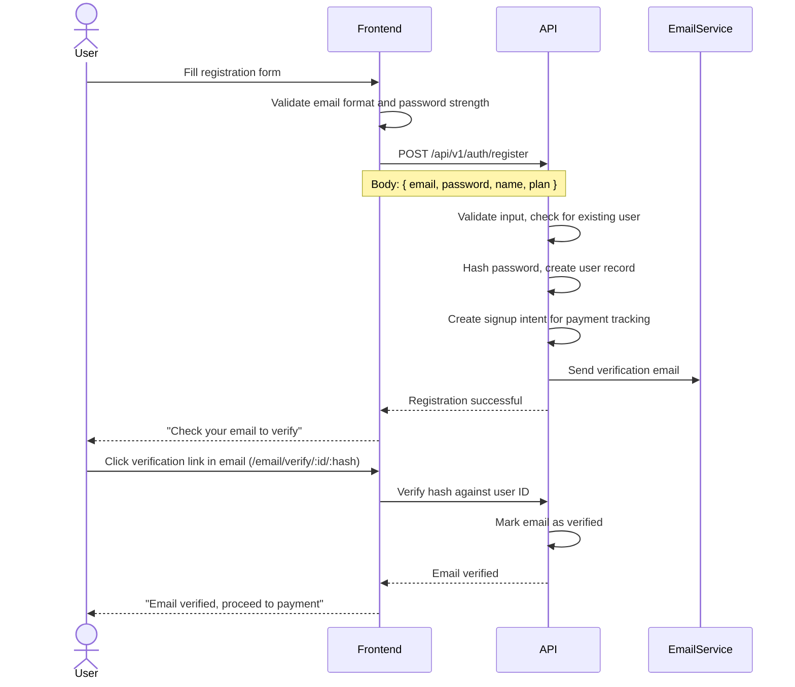
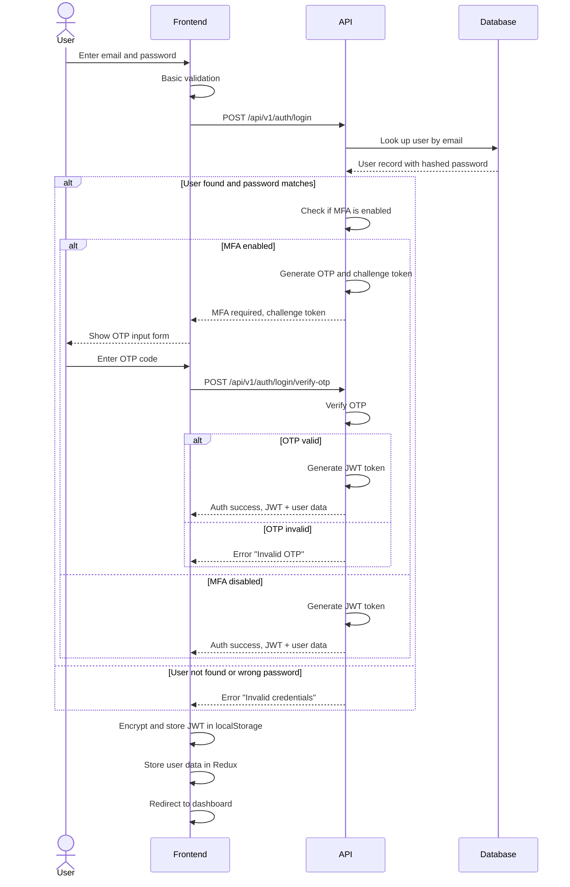
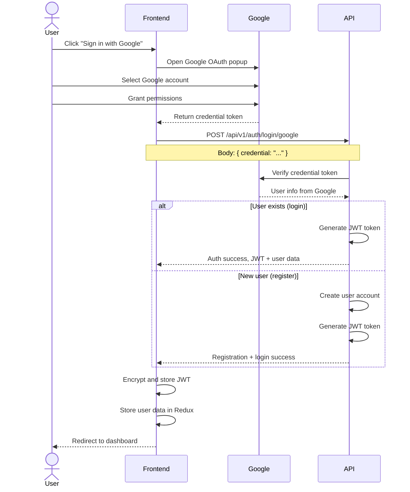

# Authentication Flow

This document explains how users authenticate with the platform. It covers registration, login, password management, OAuth, and session handling.

---

## What You Will Learn

- How users create accounts and verify their email
- How login works with email/password and Google OAuth
- How the MFA (multi-factor authentication) flow works
- How password reset and change work
- How signup intents track users through the onboarding pipeline

---

## Authentication Methods

The platform supports three authentication methods:

1. **Email and password** - Standard registration and login
2. **Google OAuth** - Sign in with Google account
3. **Passwordless email** - Email verification links for specific actions

---

## Registration Flow

After email verification, the user is directed to choose a subscription plan and enter payment information. They do not get full access until their free trial or paid plan is active.

---

## Login Flow

### Email and Password Login

### Google OAuth Login

---

## MFA (Multi-Factor Authentication)

Users can enable MFA for additional account security. When enabled, login requires both a password and a one-time passcode sent via email.

### MFA Flow

1. User enters email and password on the login form
2. If credentials are valid and MFA is enabled, the server generates a one-time passcode
3. The passcode is sent to the user's email
4. The frontend shows an OTP input form with a timer
5. User enters the OTP to complete authentication
6. An option to "trust this device" allows skipping MFA on subsequent logins from the same browser

The MFA state is maintained during page refresh through session storage and query parameters. If the user refreshes the OTP page, the challenge token and remaining cooldown timer are restored.

---

## Password Management

### Forgot Password Flow

1. User clicks "Forgot Password" on the login page
2. User enters their email address
3. Backend sends a password reset email with a unique token
4. User clicks the link and is directed to a reset password form
5. User enters a new password (must meet strength requirements)
6. Backend validates the token and updates the password
7. User is redirected to login with a success message

### Change Password Flow

For authenticated users who want to change their password:

1. User navigates to Settings > Change Password
2. User enters current password, new password, and confirm new password
3. Frontend validates new password matches confirmation
4. Backend verifies current password and updates to the new one
5. User is logged out and asked to log in with the new password

---

## Signup Intent Pipeline

When a user goes through the registration and payment flow, a "signup intent" tracks their progress through the pipeline. This is stored in localStorage and synced with the backend.

### What a Signup Intent Contains

- The selected subscription plan (plan ID, name, billing type)
- Any addons (PPC addon, additional ASIN capacity)
- Stripe price IDs for the selected options
- An intent token for server-side tracking

### Why This Matters

The signup flow can span multiple pages (registration, plan selection, payment method, confirmation). If the user refreshes or navigates away, the intent preserves their choices. When they come back, the system picks up where they left off instead of starting over.

---

## Session Handling

After successful authentication, the frontend receives a JWT token and user data. The token is encrypted with AES before being stored in localStorage. The user data is stored separately with the encrypted token embedded inside it.

### Token Storage

On login success, the JWT token is encrypted with AES and stored in localStorage alongside an expiry timestamp. User data is stored in a separate key with the encrypted token embedded within it.

### Token Retrieval

Before each API call, the stored expiry timestamp is checked. If expired, the token is removed and the user is redirected to login — preventing expired tokens from being sent to the server.

The token is checked for expiry before every use. If expired, it is removed and the user is redirected to login. This prevents sending expired tokens to the server unnecessarily.

---

## Related Documents

- [Session Management](session-management.md) - JWT handling, timeouts, cross-tab sync
- [Amazon Authorization](amazon-authorization.md) - Amazon SP-API OAuth flow
- [Security Architecture](../security/authentication-security.md) - Security best practices
- [Backend Service Architecture](../backend/service-architecture.md) - Auth service design
