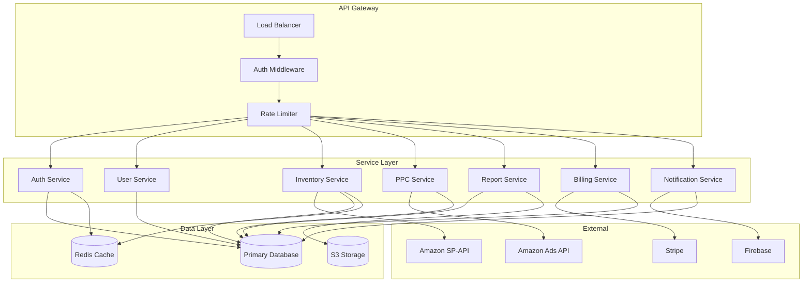

# Backend Service Architecture

This document explains the backend architecture that powers the platform. The backend handles authentication, business logic, data storage, external API integrations, and async job processing.

---

## What You Will Learn

- How the backend is organized into service domains
- How API requests flow from the frontend to the database
- How background workers handle long-running operations
- How the backend integrates with Amazon APIs, Stripe, and Firebase
- How error handling and logging work
- How the backend scales

---

## Service Architecture Overview

The backend follows a modular service architecture. Each business domain has its own service with a clear API boundary. Services communicate through well-defined interfaces, never through shared database access or internal function calls.



---

## Service Domains

### Auth Service

Handles user authentication, registration, and session management.

Responsibilities:
- Email/password registration and login
- Google OAuth login
- MFA (multi-factor authentication) with email OTP
- JWT token issuance and validation
- Password reset and change flows
- Firebase custom auth token generation
- FCM device token registration

### User Service

Manages user profiles and account settings.

Responsibilities:
- Profile CRUD (name, email, profile image)
- Amazon account management and marketplace switching
- User preferences and settings
- Account deactivation and deletion

### Inventory Service

Manages all inventory-related data and operations.

Responsibilities:
- FBA inventory levels and health
- Product catalog management
- Sales data and analytics
- FBA shipment creation and tracking
- 3PL warehouse management
- Production order lifecycle
- Futuristic data and demand forecasting
- Barcode and label generation
- A/B price testing experiments

### PPC Service

Manages Amazon advertising campaigns.

Responsibilities:
- Sponsored Products campaign management
- Sponsored Brands campaign management
- Sponsored Display campaign management
- Strategy engine automation (bid optimization, keyword harvesting)
- Performance analytics and aggregation
- Change history and audit logging
- Bulk campaign operations

### Report Service

Generates complex reports that require async processing.

Responsibilities:
- Profit and loss report generation
- Futuristic data events report
- Cost breakdown analysis
- Report status tracking and notification
- Report data caching and retrieval

### Billing Service

Manages subscriptions and payments.

Responsibilities:
- Subscription plan management
- Stripe integration for payment processing
- Invoice generation and tracking
- Payment method management
- Coupon and discount handling
- Trial period management

### Notification Service

Handles all user-facing notifications.

Responsibilities:
- Push notification sending via Firebase Cloud Messaging
- In-app notification storage and delivery
- Alert and tip delivery
- Real-time notification signals via Firestore
- Notification grouping and read/unread tracking

---

## API Design

### Endpoint Structure

All API endpoints follow a RESTful pattern:

```
GET    /api/v1/inventory/list       - List inventory items
POST   /api/v1/inventory/update     - Update inventory details
GET    /api/v1/ppc/campaigns        - List PPC campaigns
POST   /api/v1/ppc/campaigns        - Create a campaign
PUT    /api/v1/ppc/campaigns/{id}   - Update a campaign
DELETE /api/v1/ppc/campaigns/{id}   - Delete a campaign
```

### Authentication

All authenticated endpoints require a Bearer token in the Authorization header:

```
Authorization: Bearer <jwt-token>
```

The auth middleware validates the token on every request. It checks:
1. The token is valid and not expired
2. The user still exists in the database
3. The user's account is active (not deactivated)
4. The user has permission to access the requested resource

### Error Responses

All errors follow a consistent format:

```json
{
    "status": "error",
    "message": "Human-readable error message",
    "code": "ERROR_CODE"
}
```

HTTP status codes follow standard conventions:
- 200: Success
- 201: Created
- 400: Bad request (validation error)
- 401: Unauthorized (missing or invalid token)
- 403: Forbidden (insufficient permissions)
- 404: Not found
- 422: Unprocessable entity (validation failure)
- 429: Too many requests (rate limit)
- 500: Internal server error

---

## Background Jobs

Long-running operations are processed asynchronously by background workers.

### Job Queue

The platform uses a queue-based job system. Jobs are created by the API layer and processed by workers running in separate processes.

Types of background jobs:

| Job Type             | Description                                                        | Typical Duration   |
| -------------------- | ------------------------------------------------------------------ | ------------------ |
| Amazon data sync     | Pull inventory, sales, shipments, orders from SP-API               | 2-10 minutes       |
| PPC data sync        | Pull campaign performance from Ads API                             | 1-5 minutes        |
| Report generation    | Generate futuristic data calendar or P&L report                    | 30-90 seconds      |
| Email sending        | Send verification, password reset, or notification emails          | Varies by provider |
| Notification batch   | Send push notifications to multiple recipients                     | 1-30 seconds       |

### Job Lifecycle

1. API endpoint creates a job record in the database with status "pending"
2. Job is added to the queue
3. Worker picks up the job and processes it
4. Worker updates the job status to "completed" or "failed"
5. If failed, the job is retried up to 3 times with exponential backoff

### Data Sync Jobs

The largest background job is Amazon data synchronization. This is a multi-step process:

1. Worker receives a sync request with the user's marketplace and Amazon account ID
2. Worker requests an access token using the stored refresh token
3. Worker calls SP-API endpoints sequentially for each data type
4. Each data type is processed and stored in the database
5. Progress is logged per-step so the frontend can show sync status
6. When all steps complete, the sync session is marked as "completed"

If any step fails (due to Amazon API rate limiting or temporary errors), the worker retries that step before moving on. Persistent failures are logged and the sync continues with remaining steps.

---

## External Integrations

### Amazon SP-API

The Selling Partner API provides access to Amazon's e-commerce data. The backend communicates with it through REST endpoints.

Key integration points:
- Inventory summaries
- Product catalog
- Sales metrics
- Shipment tracking
- Financial reports
- Order management

### Amazon Advertising API

The Advertising API manages PPC campaigns. The backend communicates with it through REST endpoints.

Key integration points:
- Campaign CRUD
- Ad group management
- Keyword and targeting management
- Performance reporting
- Budget management

### Stripe

Stripe handles all payment processing. The backend communicates through the Stripe API.

Key integration points:
- Customer creation and management
- Subscription creation and management
- Payment method handling
- Invoice generation
- Webhook handling for payment events

### Firebase Cloud Messaging

FCM handles push notifications. The backend sends notifications through the Firebase Admin SDK.

Key integration points:
- Sending push notifications to individual devices
- Managing device tokens
- Handling notification delivery

---

## Caching Strategy

The backend uses Redis for caching. Cached data includes:

| Data                                  | Cache Duration            | Invalidation |
| ------------------------------------- | ------------------------- | ------------ |
| Amazon API access tokens              | Until expiry (1 hour)     | On expiry    |
| Frequently accessed reference data    | 5 minutes                 | Time-based   |
| User session data                     | Session duration          | On logout    |
| API rate limit counters               | Sliding window            | Automatic    |

---

## Error Handling

The backend has a structured error handling approach:

1. **Validation errors** - Returned immediately with field-level error details
2. **Authentication errors** - Returned as 401, triggers frontend logout
3. **Authorization errors** - Returned as 403 with permission details
4. **Not found errors** - Returned as 404 with resource identification
5. **External API errors** - Logged and retried with backoff
6. **Unexpected errors** - Logged with full stack trace, returned as 500

All errors are logged to a centralized logging system with context (user ID, request ID, endpoint, duration).

---

## Monitoring and Observability

The backend exposes monitoring endpoints and logs structured data for observability:

- Health check endpoint for load balancer monitoring
- Request logging with timing, status, and user context
- Job queue monitoring for backlog detection
- External API call tracking with latency and error rates
- Database query performance logging

---

## Related Documents

- [Architecture Overview](../architecture/overview.md) - System-level architecture
- [Data Flow](../architecture/data-flow.md) - How data moves through the system
- [Authentication Flow](../authentication/authentication-flow.md) - User authentication
- [Amazon Authorization](../authentication/amazon-authorization.md) - Amazon API authorization
- [CI/CD Pipeline](../deployment/deployment-pipeline.md) - Build and deploy pipeline
