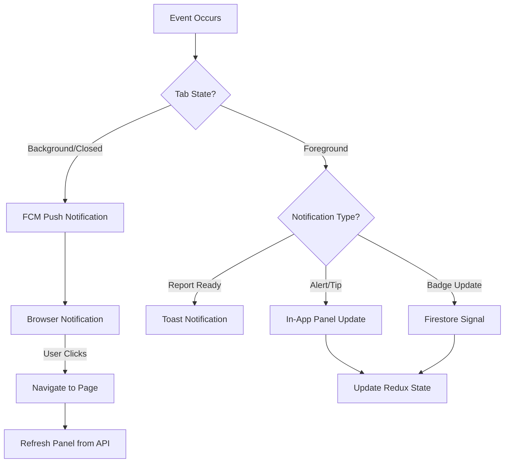
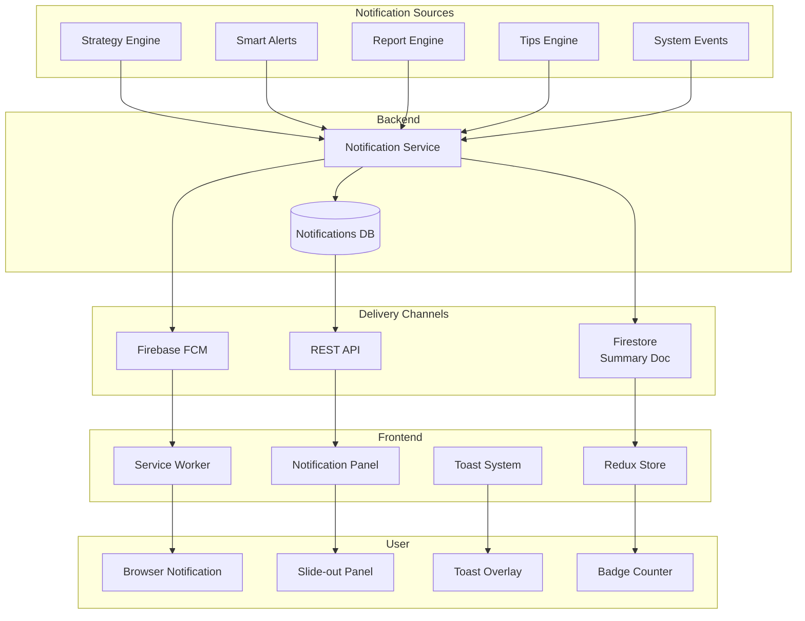
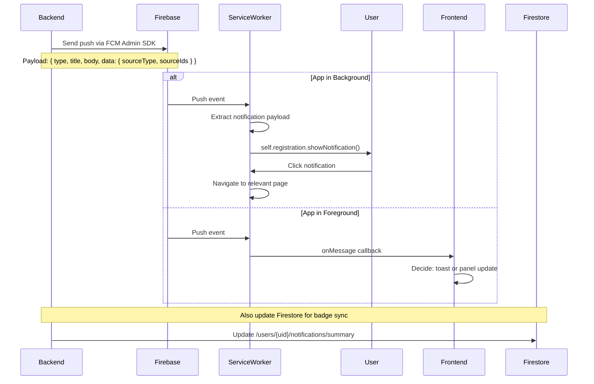

# Notification Architecture

The notification system delivers messages to users through multiple channels. It handles alerts, tips, system messages, and async report completions through push notifications, in-app notifications, and real-time updates. This document covers the full multi-channel delivery architecture, how notifications are grouped and stored, the badge count synchronization mechanism, and the notification panel component design.

---

## What You Will Learn

- How the multi-channel notification system is structured with fallback priorities
- How Firebase Cloud Messaging delivers push notifications to backgrounded tabs
- How Firestore provides real-time notification signals for foreground tabs
- How the notification panel groups and displays messages with infinite scroll
- How badge counts are synchronized between the backend, Firestore, and local state
- How notification read/unread status is managed
- How the force logout clears notification subscriptions
- How notification preferences are configured at the user level

---

## Three-Channel Delivery Architecture

The system delivers notifications through three channels. Each channel has a specific job and they work together to ensure users never miss important events.

| Channel             | Technology               | Delivery Mechanism                    | Priority | Best For                     |
| ------------------- | ------------------------ | ------------------------------------- | -------- | ---------------------------- |
| Push Notifications  | Firebase Cloud Messaging | Service worker + browser notification | High     | Tab backgrounded or closed   |
| In-App Panel        | REST API + localStorage  | Slide-out panel in navbar             | Medium   | Browsing all notifications   |
| Toast Notifications | react-toastify           | Overlay toast in current view         | Low      | Immediate operation feedback |

### Channel Selection Strategy



---

## Architecture Overview



---

## Notification Sources

| Source             | Triggers                                                     | Volume          | Channel Priority        |
| ------------------ | ------------------------------------------------------------ | --------------- | ----------------------- |
| Strategy Engine    | Campaign bid changes, keyword additions, pauses              | Per evaluation   | Push + Panel            |
| Smart Alerts       | Low stock, shipment past ETA, high return rate               | Real-time       | Push + Panel            |
| Report Engine      | P&L report ready, futuristic report ready                    | On demand       | Toast + Push + Panel    |
| Tips Engine        | Business optimization suggestions                            | Daily digest    | Panel only              |
| System Events      | Account changes, subscription updates, sync completions      | Infrequent      | Panel + Push (critical) |

---

## Notification Data Flow

### Push Notification Flow (Background)



### In-App Notification Flow (Foreground)

When the app is in the foreground, the frontend subscribes to a Firestore document that tracks unread count. The first snapshot is skipped because initial data comes from the REST API. Only subsequent updates (representing new notifications) trigger badge count changes and panel refreshes.

**Key design decision:** The first Firestore snapshot is skipped because the notification panel loads its initial data from the REST API on page mount. Only subsequent updates (new notifications arriving) trigger badge count changes and panel refreshes. This prevents a redundant initial load.

---

## Notification Data Structure

Each notification record contains the type, source, related resource IDs, individual items (for grouped notifications), a group key for deduplication, title/message, count, read status, timestamp, and an action URL for navigation.

---

## Notification Grouping

Related notifications are grouped by `source_type` within a time window:

Notifications are grouped by source type within a daily window. Each group shows a count badge and is expandable to reveal individual items with their specific details (ASIN, stock level, etc.).

The frontend displays grouped notifications with:
- Count badge showing number of items in the group
- Chevron to expand/collapse individual items
- Individual items show specific details (ASIN, stock level, etc.)

---

## Badge Count Synchronization

The notification badge (unread count) is synchronized through three mechanisms:

| Mechanism         | Direction          | Latency      | Reliability       |
| ----------------- | ------------------ | ------------ | ----------------- |
| REST API          | Backend -> Frontend | On page load | Always available  |
| Firestore snapshot | Backend -> Frontend | Real-time    | Requires Firebase |
| localStorage event | Tab -> Tab         | Instant      | Same origin only  |

When a notification is marked as read in one tab, the unread count decreases in all other tabs through the Firestore listener. If Firebase is not available, the REST API on page navigation provides the updated count.

---

## Notification Panel Component

The notification panel is a slide-out drawer that opens from the right side of the navbar:

```javascript
const NotificationPanel = ({ isOpen, onClose }) => {
    const dispatch = useDispatch();
    const notifications = useSelector(state => state.notifications.items);
    const meta = useSelector(state => state.notifications.meta);
    const loading = useSelector(state => state.notifications.loading);
    const [activeTab, setActiveTab] = useState('all'); // 'all', 'alerts', 'tips', 'info'

    // Infinite scroll
    const loadMore = useCallback(() => {
        if (meta.pagination.current_page < meta.pagination.last_page) {
            dispatch(fetchNotifications({
                page: meta.pagination.current_page + 1,
                type: activeTab === 'all' ? undefined : activeTab
            }));
        }
    }, [meta.pagination, activeTab]);

    // Scroll listener for infinite scroll
    const handleScroll = useCallback((e) => {
        const { scrollTop, scrollHeight, clientHeight } = e.target;
        if (scrollHeight - scrollTop <= clientHeight + 100) {
            loadMore();
        }
    }, [loadMore]);

    return (
        <SlideOverlay isOpen={isOpen} onClose={onClose}>
            <PanelHeader>
                <TabSelector active={activeTab} onChange={setActiveTab} />
                <MarkAllReadButton onClick={() => dispatch(markAllNotificationsRead())} />
            </PanelHeader>

            <PanelBody onScroll={handleScroll}>
                {loading && <SectionLoader />}

                {notifications.length === 0 && !loading && (
                    <EmptyState message="No notifications" />
                )}

                {groupedNotifications.map(group => (
                    <NotificationGroup key={group.group_key} group={group} />
                ))}
            </PanelBody>
        </SlideOverlay>
    );
};
```

### Panel Features

| Feature          | Implementation                                               |
| ---------------- | ------------------------------------------------------------ |
| Tab filtering    | All, Alerts, Tips, Info - each filters by notification type  |
| Infinite scroll  | Loads next page when user scrolls within 100px of bottom     |
| Mark all read    | Dispatches `markAllNotificationsRead()` action                |
| Individual read  | Click any notification to mark it as read and navigate        |
| Empty state      | Shows "No notifications" message with relevant illustration  |
| Loading state    | Shows SectionLoader placeholder while fetching               |
| Badge counter    | Shows unread count in navbar, updated in real-time           |

---

## Notification Preferences

Users can configure which notification types they receive:

- Alert notifications (on/off)
- Tip notifications (on/off)
- Push notifications (on/off)
- Email notifications (on/off)

Preferences are stored in the user settings and synchronized with the backend. Changes take effect immediately for in-app notifications and on the next sync cycle for push notifications.

---

## Redux State for Notifications

```javascript
The notification state in the store tracks items, metadata (badge count and pagination), loading state, and user preferences for each notification type.
```

---

## Interview Talking Points

**On the three-channel strategy:** "We use three channels for notifications because no single channel covers all use cases. Push notifications via FCM work when the tab is in the background. Firestore provides real-time badge count updates when the user is actively using the app. Toast notifications give immediate feedback for completed operations. Each channel has a specific job and they complement each other. Users get push notifications for critical alerts and in-app updates for less urgent messages."

**On the Firestore first-snapshot skip:** "When the app loads, the notification panel fetches data from the REST API. The Firestore onSnapshot listener fires immediately with the current document state. If we processed that first snapshot, it would duplicate the initial API load. We skip the first snapshot and only process subsequent ones. This ensures we only update the badge count when new notifications arrive, not on page load."

**On notification grouping:** "Grouping was a UX decision. If a product goes out of stock and the system sends 5 alerts in 5 minutes, showing 5 separate notifications is overwhelming. Grouping them into a single item with a count and expandable list keeps the panel manageable. The group key is based on the source type and a time prefix, so notifications from the same source within a day get grouped together."

**On the badge count synchronization:** "The badge count is synchronized through three mechanisms: REST API for initial load, Firestore for real-time updates, and localStorage events for cross-tab sync. This three-layer approach means the badge is always correct, even if one channel is unavailable. If Firebase is not configured, the badge still works through REST API polling."

**On the force logout cleanup:** "When a user's session ends, we need to stop sending push notifications to their browser. The force logout flow sends a request to delete the user's FCM device token from the backend. This prevents notifications from appearing in a browser where the user is no longer logged in. The service worker continues to exist, but it no longer receives messages from our server because the token is removed."

---

## Related Documents

- [Push Notifications](push-notifications.md) - FCM configuration and service worker
- [Real-Time Signals](real-time-signals.md) - Firestore integration
- [Report Polling](report-polling.md) - Async report completion notifications
- [Notification Panel](notification-panel.md) - UI component deep dive
- [Alert Architecture](../alerts/alert-architecture.md) - Alert engine
- [Firebase Integration](../integrations/external-integrations.md) - Firebase setup
