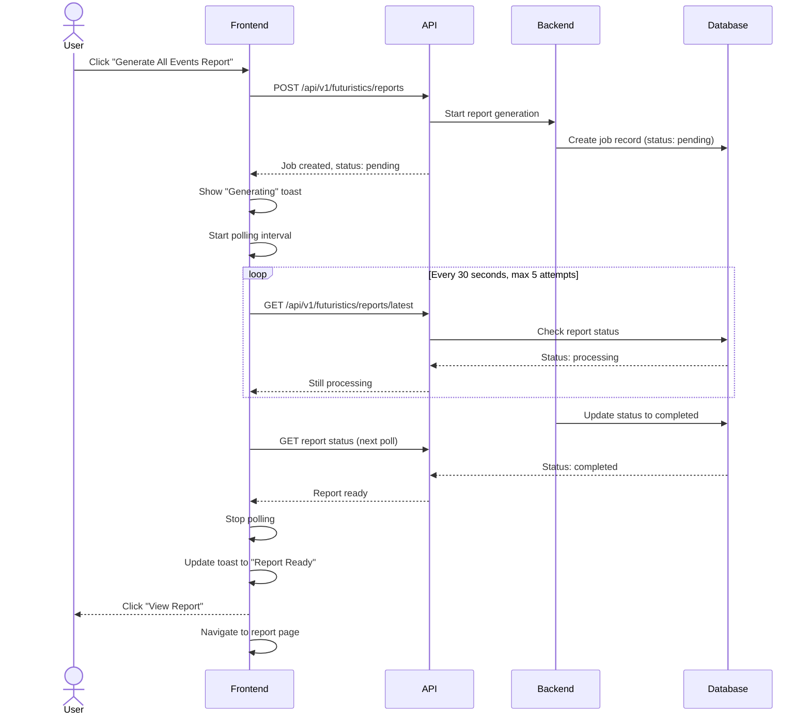

# Report Polling

Some operations take too long to complete within a single HTTP request. The report polling system handles these by kicking off an async job, then checking for completion at regular intervals.

---

## What You Will Learn

- How the singleton polling service works
- How the polling interval and retry logic work
- How the toast notification system signals completion
- How the polling service integrates with futuristic analytics

---

## The Polling Pattern

---

## Singleton Polling Service

The polling service is a singleton class that prevents multiple polling loops from running simultaneously.

The polling service is implemented as a singleton class that prevents multiple polling loops from running simultaneously. It checks a status endpoint every 30 seconds for up to 5 attempts (2.5 minutes total). If the report completes during this window, a toast notification is shown with a "View Report" button. If all attempts are exhausted, it stops silently.

---

## Toast Notification Integration

When a report is ready, a toast notification appears:

The toast component shows two states: "Generating..." while polling is active, and "Report Ready" with a "View Report" button when the report completes. Clicking the button navigates to the report page.

The toast shows two states:
1. **Generating** - "Generating All Products Events Report..." while polling
2. **Completed** - "All Products Events Report is Ready" with a "View Report" button

---

## Route-Aware Behavior

The polling service tracks the current route and adjusts behavior:

- If the user is on the futuristic data page with `?view=all`, the report data loads automatically
- If the user is on a different page, they see a toast when the report is ready
- Clicking the toast navigates to the report page

---

## Report Source Tracking

The polling service tracks where the report generation was triggered from:

The polling service tracks which route triggered the report generation. When the user clicks "View Report," they are navigated to the same path.

When the user clicks "View Report" on the toast, they are navigated to the same path that triggered the report generation.

---

## Interview Talking Points

**On the singleton pattern:** "The polling service is a singleton because we only want one polling loop running at a time. If two reports are triggered while the first is still polling, the second one just reuses the existing poller instead of starting a second loop. This prevents flooding the API with redundant requests."

**On the max poll limit:** "We limit polling to 5 attempts (about 2.5 minutes). If the report is not ready by then, we stop silently. The user can manually check later. This prevents infinite polling if something goes wrong on the backend."

## Related Documents

- [Notification Architecture](notification-architecture.md) - System overview
- [Futuristic Analytics](../inventory/futuristic-analytics.md) - Report generation context
- [Notification Panel](notification-panel.md) - UI component
- [Toast System](../frontend/ui-design-system.md) - Toast notification design
